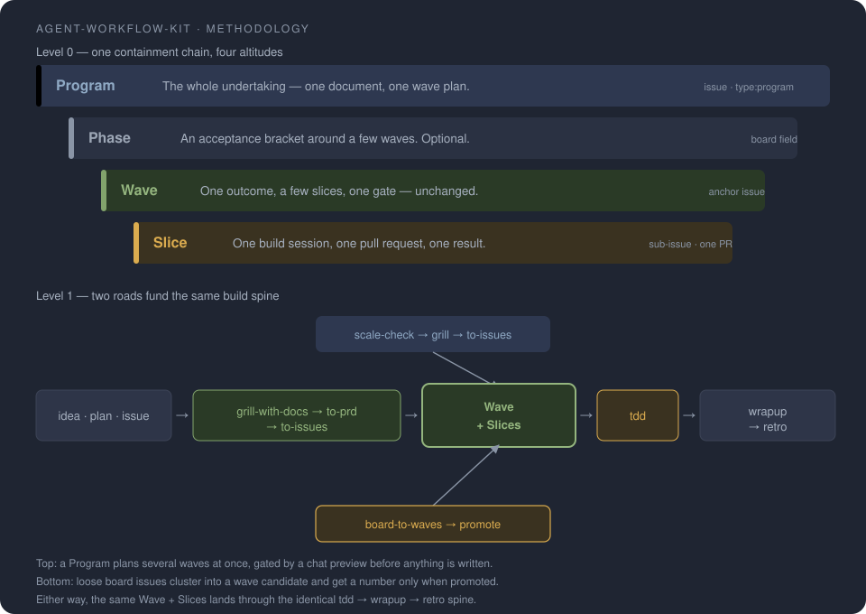

# agent-workflow-kit

**A complete shipping loop for coding agents — plan → execute → land → learn.**

## Maintainer build

The public repository is the source of truth. A fresh clone needs Node 20 or
newer, Python 3, and no Python packages:

```sh
npm install --ignore-scripts
npm test
npm run kit:build
npm run kit:staleness
npm pack --dry-run
```

`kit:build` assembles `dist-kit/` only from files in this checkout and writes a
sha256 manifest. `kit:staleness` compares that fresh manifest with the checked-in
install manifest. The frozen `v0.9.0` manifest remains under `test/fixtures/` as
the historical golden baseline; current builds intentionally include later SSOT
changes.

Maintainers prepare releases with `/kit-release`. It derives the shipped delta
from a fresh manifest, recommends Semver, applies only the confirmed target,
regenerates the checked-in manifest, and runs the full test and pack gates.
Landing remains owned by `/wrapup` and only integrates the prepared version.
After a separate publication confirmation, a matching annotated `v<version>`
tag on canonical `main` starts the trusted publish flow. Manual dispatch
requires an explicit existing tag and only reconciles an incomplete release.

These are the skills, helper scripts, and conventions one team actually uses to
take work from a vague idea to a merged, verified PR with [Claude Code] and
[Codex]. One `npx` command drops them into any repo; `/setup-workflow` wires
them to your tracker and board. Edit anything — updates never clobber your changes.

[Claude Code]: https://claude.com/claude-code
[Codex]: https://developers.openai.com/codex/cli

## Quickstart

```sh
# from the root of the repo you want to add the workflow to
npx github:iKon85/agent-workflow-kit init
```

1. **`init`** copies the skills + helper scripts in, and seeds empty
   project-layer stubs. It never overwrites a file you already have.
2. **Run `/setup-workflow`** once (in Claude Code / Codex). A guided, idempotent
   skill that detects your issue tracker, writes your label + domain + deploy
   config, and — for a GitHub Projects board — discovers the field IDs into a
   board profile. See [Configuration](#configuration).
3. **Start working.** Trigger skills by name (`/grill-with-docs`, `/tdd`,
   `/wrapup`, …) — the workflow below explains when each one earns its keep.
   Unsure which one fits? Run **`/ask-matt`** — it routes you to the right skill.

## The workflow it installs

The skills aren't a grab-bag — they're four phases of one loop, entered through a
single funnel no matter where your work starts. Each phase below names the failure
mode it removes and the skills that remove it.

![The workflow as a subway map — one row per route, all converging on the same implement → wrapup → retro spine: a scale-check router sizes unclear work; the main line runs idea through an optional grill, to-prd, to-issues and a gate into implement (which drives tdd inside), wrapup, retro; a grill line scales from none over grill-me and grill-with-docs up to the +codex variants; a codex line adds cross-model review and build; program and board lines fund numbered waves built by orchestrate-wave; repair (diagnose) and structure (improve-codebase-architecture) lines enter from broken or tangled work; a learn line routes retro's findings into config by weight. Interchanges: verify-spike / decision-gate before an unknown, prototype for an unclear path, local-ci plus pre-commit/pre-push hooks before landing, ask-matt when lost, and a one-time setup lane.](docs/workflow.png)

<!--
  The image above is a pre-rendered PNG, not live HTML, on purpose: GitHub
  READMEs can't embed HTML pages, and a PNG renders identically everywhere.
  Source of truth: docs/workflow.html (same design language as
  docs/methodology.html). Regenerate after editing the source:
    serve docs/ locally, open workflow.html?theme=dark in a 1160px-wide
    viewport, take a full-page screenshot -> docs/workflow.png
  The interactive version is linked below and published via GitHub Pages.
-->

**[view the workflow map →](https://ikon85.github.io/agent-workflow-kit/workflow.html)**


### 1. Plan — turn a vague idea into shaped, tracked work

> *Agents dive into code before the problem is sharp, then build the wrong thing
> well.* The plan phase makes you earn a clear spec first.

**One funnel, many doors, one shape.** There's no single front door. You enter
wherever your work actually starts — a vague idea, a plan you already wrote, a PRD
pasted from another tool, a raw issue, or a whole backlog — and every door funnels
into the *same shaped artefact*: a Draft-PRD that, once sliced, becomes either one
atomic issue or a wave anchor with child slices. What counts downstream is the
**shape of the artefact, never where it came from** — so each step can be entered
cold and *extracts or synthesizes* what's missing instead of assuming an earlier
step ran. The entry key is just *"is there an issue yet?"*: a loose artefact
(no issue) enters at `to-prd`; an existing issue or file-bundle enters at
`to-issues` directly. Inside that facade, the explicit PRD identity — Feature or
Program — is the only mode selector; a cold source must establish one before a
remote write.

- **Grill as deep as the work deserves — it's optional.** `grill-me` /
  `grill-with-docs` interrogate the intent (and your domain docs) until the real
  requirement surfaces, instead of latching onto the first framing. Skip it for a
  mechanical change, run a light grill for a normal feature, add `+codex` (below)
  for something high-stakes. Your call, per piece of work.
- **`to-prd`** turns whatever you bring — idea, plan, external spec — into a short
  Draft-PRD issue, *extracting* the template sections from what already exists. A
  required section it genuinely can't derive becomes an honest **Open points**
  block, never a silent "looks complete" placeholder.
- **`to-issues`** is the single public Planning facade. Explicit Feature
  identity selects tracer-bullet decomposition and picks the shape: **1 slice →
  one atomic issue** the PR closes; **≥2 slices → a wave anchor** with linked
  child slices. Explicit Program identity selects the existing internal graph
  engine and preserves its complete chat preview before any board write.
  Missing or contradictory identity stops before a write; size, prose, and model
  judgment never select the mode. Any unresolved *Open points* travel through as
  a build-blocking gate (the profile's configurable `vorBau` heading, see
  [Configuration](#configuration)) that never vanishes silently.
- **`board-to-waves`** clusters an existing backlog into themed campaigns when you
  need to *find* the next wave rather than start fresh.
- **`triage`** keeps the inbox sane with a consistent label vocabulary.
- **`spec-self-critique`** red-teams your own spec before you commit to building it.
- **`verify-spike` / `decision-gate` — gate-before-build.** When `to-issues` cuts a
  slice that hinges on an unknown it tags the slice instead of guessing: a single
  yes/no fact against the real lib/runtime/DB runs as a **`verify-spike`** (throwaway
  read-only harness, verdict + proof sunk to the issue); a bounded "which option"
  trade-off or a research gap runs as a **`decision-gate`** (read-only weigh-up,
  options × criteria table, reasoned pick sunk to an ADR/issue). The gate is its own
  slice, sequenced *before* the build slice it blocks — clarify the one open point
  cheaply instead of re-grilling the whole feature; genuinely hard-to-reverse calls
  still escalate up to `+codex`.
- **`domain-modeling` / `codebase-design` — shared design vocabulary.** When a slice
  is about *shaping* rather than shipping — pinning down the ubiquitous language and
  ADRs (`domain-modeling`) or designing a deep module behind a clean seam
  (`codebase-design`) — these give the grill and the design work a precise, consistent
  vocabulary instead of ad-hoc terms.
- **`wayfinder` — when the idea is too big for one session.** Charts a foggy,
  multi-session effort as a shared **map** issue with investigation tickets on
  your tracker (native blocking renders the frontier visually), resolved one
  per session until the way to the destination is clear — planning, not doing.
- **`research`** delegates primary-source reading legwork to a background
  agent; the findings land as a cited Markdown note in the repo.

You approve the slice breakdown before anything is published — the funnel never
publishes behind your back.

### 2. Execute — build it right, not just fast

> *"Make the tests pass" drifts into untested, sprawling, hard-to-review change.*
> The execute phase keeps the diff disciplined.

- **`tdd`** — a strict red → green → refactor loop; the test is written first
  and must fail for the right reason.
- **`prototype`** — spike a throwaway when the path is genuinely unclear, so the
  real implementation is informed.
- **`implement`** — drive a PRD or a set of issues to done: `tdd` at the agreed
  seams, typecheck + single-file tests throughout, the full suite once at the end,
  then a `code-review` pass before it lands.

**Two more skills are doors of their own, not funnel steps.** You reach for them
when the work *starts* broken or tangled rather than from a fresh idea, so they
enter outside the plan funnel and feed straight into Execute:

- **`diagnose`** — a disciplined root-cause hunt for bugs (reproduce → isolate →
  fix → prove), not a guess-and-patch. Entered from a bug or anomaly, never the PRD
  funnel; the fix it lands flows on into Execute.
- **`improve-codebase-architecture`** — step back from the diff to
  the structure when a change is fighting the codebase. A recon stream that either
  becomes a planned slice (back through `to-issues`) or guides a refactor in place.

### 3. Land — ship without surprises

> *The risky part is the merge: half-checked PRs, broken hooks, context lost at
> handoff.* The land phase puts mechanical gates in front of the commit.

- **`wrapup`** — the land-and-clean closeout: make the branch landable, enforce
  the PR body contract, merge the PR, reconcile the board, tear the finished
  worktree down, retire the branch, sweep merged branches, and surface anything
  still open. It does not replace live verification; verify the user outcome
  before landing. Interrupted halfway? Re-run it — every step re-reads present
  state (does the PR exist, is it merged, is the worktree still there?) and skips
  what is already done, so there is no separate resume mode and no journal to
  repair.
- **Teardown asks your repository, not a config file.** Finishing a worktree
  classifies it with git's own file taxonomy at the moment it acts: a tracked
  change or an unmerged path blocks, an untracked file your repo does *not*
  ignore blocks with a bounded report, and an ignored entry is scratch that dies
  with the worktree. Making something disposable therefore means ignoring it —
  the full rules, the `.env*` exception, and the breaking change from the pattern
  keys are in [the worktree lifecycle](#the-worktree-lifecycle).
- **The pre-commit / pre-push gate fires automatically** — TypeScript, lint, and
  contract guards block a broken commit or push. You don't run a skill here; the
  gate was installed once at setup (`git-guardrails` / `setup-pre-commit`, both
  Claude only, see Configuration) and now guards every Land.
- **`resolving-merge-conflicts`** — a disciplined loop for an in-progress
  merge/rebase conflict: understand each side's intent from history/PRs, preserve
  both where possible, always resolve (never `--abort`), then re-run the checks.
- **Helper scripts** — `pr-body-check.py`, `execute-ready-check.py`, and
  `board-sync.py` keep the PR and the issue tracker honest (see Configuration).

### 4. Learn — compound the lessons instead of repeating them

> *The same mistake recurs because nothing captured it.* The learn phase turns
> friction into config.

- **`retro`** — an in-session post-mortem that proposes concrete changes to your
  rules, skills, or hooks, each with per-patch approval.
- **`write-a-skill`** (Claude only) — turn a move you keep repeating into a
  reusable skill.

### Optional: cross-model review (via Codex)

An independent second model is a cheap way to catch what one model rationalizes.
**`grill-me-codex` / `grill-with-docs-codex`** run the grill through Codex,
**`codex-review`** gets a second-opinion plan review, and **`codex-build`**
flips the roles for an optional Act 3 (Codex implements the frozen spec in a
bounded workspace-write sandbox, Claude verifies the diff and proof). All four
are Claude only (invoked from Claude Code, which shells out to the Codex CLI)
and need the Codex CLI installed.

### The altitude model

The four phases above are what you *do*. Underneath them sits a shape for
*what you're doing it to* — a plan travels through four altitudes, and each
hands a well-defined object to the level below:

| Altitude | What it is | Artefact |
|---|---|---|
| **Program** | The whole undertaking, described once with a wave plan attached. | one PRD issue |
| **Phase** | An acceptance bracket around a handful of waves. Optional. | a board field |
| **Wave** | The working unit: one outcome, a few slices, one gate — exactly the wave you already build with the flow above. | one anchor issue |
| **Slice** | One build session, one pull request, one visible result. | one sub-issue |

Two roads lead to the same wave. **Top-down:** `scale-check` names the size in
a few plain questions; a big undertaking gets grilled once into a Program PRD
with a wave plan, and `to-issues` selects its internal Program graph path from
that explicit identity. It unfolds the plan into named waves after you approve
a full preview in chat — zero board writes until you say yes. **Bottom-up:**
`board-to-waves` clusters loose issues into a wave candidate, which earns a
real number only when you promote it. Either road lands in the *identical*
wave anchor plus slice sub-issues, built through the same `implement` → `wrapup` →
`retro` spine as every other wave.

When the slices are file-disjoint and their specs are locked, **`orchestrate-wave`**
lands the whole anchor end-to-end — often AFK: it dispatches an implementer per
slice into its own worktree, integrates serially, verifies centrally, and lands
the wave. It's the execute-and-land node of the wave ladder (`scale-check` →
`to-issues` / `board-to-waves` → `orchestrate-wave`); a single slice still just
goes to `implement`.



The full walkthrough — every entry point, the build-layer skills, and the six
mechanics that keep a multi-wave plan honest (gates, drift propagation, the
revision loop, `program-sync`, and counted completeness) — lives on one page:
**[read the methodology →](https://ikon85.github.io/agent-workflow-kit/methodology.html)**
(also shipped as `docs/methodology.html` in your install, so it works offline too).

## Configuration

The skills ship the *how*; your repo supplies the *what*. `init` only lays down
empty stubs — **`/setup-workflow` fills them**. It's a guided, idempotent skill
(not a script): it explores your repo, confirms with you section by section, and
writes:

| It writes | So that |
|---|---|
| `docs/agents/issue-tracker.md` | `to-issues` / `triage` know whether to call `gh`, `glab`, or follow your flow |
| `docs/agents/triage-labels.md` | triage uses *your* label vocabulary |
| `docs/agents/domain.md` | the domain skills find your `CONTEXT.md` / ADR layout |
| `docs/agents/board-sync.md` | the board scripts get your GitHub Projects field IDs (the **board profile**) |
| `## Agent skills` + `## Prod` in `CLAUDE.md` / `AGENTS.md` | the agent knows your skills and deploy target |

Each generated file carries a `setup-workflow` sentinel on its first line, so a
re-run only fills what's missing and **never overwrites content you've filled in**.

Two more one-time skills harden the repo when you adopt the kit — both **Claude
only**: **`git-guardrails`** installs the secret / branch / broken-build
guardrails, and **`setup-pre-commit`** wires the pre-commit gate. Run them once
— afterwards the gate fires automatically on every commit and push (see the
Land phase above).

### The board profile

The board helper scripts carry **no hard-coded IDs**. They read everything
board-specific from a single fenced `json` block in `docs/agents/board-sync.md`,
marked `<!-- board-sync:profile -->`:

```json
{
  "repo": "<owner>/<repo>",
  "project": { "number": 1, "owner": "<owner>", "nodeId": "<project-node-id>" },
  "fields": {
    "status": {
      "id": "<status-field-id>",
      "options": { "Spec": "<option-id>", "In Progress": "<option-id>", "Done": "<option-id>" },
      "roles": { "spec": "Spec", "inProgress": "In Progress", "done": "Done" }
    },
    "wave": "<wave-field-id>",
    "cluster": "<cluster-field-id>",
    "specPath": "<field-id>",
    "planPath": "<field-id>"
  },
  "labels": {
    "readyForAgent": "ready-for-agent",
    "typePrefix": "type:",
    "clusterType": "type:cluster",
    "waveStub": "wave-stub"
  },
  "branchPrefixes": ["feat", "fix", "chore", "docs"],
  "prMarkers": { "partOf": "Part of", "retroMarker": "**Retro:**", "retroValues": ["ran", "skipped"] },
  "headings": { "vorBau": "Clarify Before Build" }
}
```

`/setup-workflow` discovers these values for you from `gh project field-list`;
you rarely touch this by hand. Point a script at an alternate profile with the
`BOARD_SYNC_PROFILE` environment variable. Labels, branch prefixes, and headings
are *yours* to rename — the scripts read whatever the profile says.

Status stage names are yours too: scripts and skills address stages by semantic
**role** (`fields.status.roles`: `idea/triaged/spec/inProgress/review/done` →
your option names, e.g. `board-sync.py add --status-role spec`), so a board in
any language works — map each role once, rename an option with one profile edit.

### The worktree lifecycle

An optional capability, offered once by `/setup-workflow` and recorded in your
own `docs/agents/workflow-capabilities.json`. Enabled, it gives each build its
own linked worktree: `python3 scripts/worktree-lifecycle/setup.py` cuts the
branch, creates the worktree from your naming templates, and runs your project's
setup steps; on Claude Code a set of hook adapters keeps edits, verification
commands, and Git mutations in the checkout they belong to; and `wrapup` tears
the worktree down after the merge. A worktree belongs to a **build** — a session
that only plans or grills stays in the main checkout, keeps its scratch on disk,
and lands its durable output as ordinary content.

The profile carries structural facts only: where worktrees live
(`worktreeRoot`), how branches and paths are named (`branchTemplate`,
`contentBranchTemplate`, `pathTemplate`, `branchRegex`), which branches are
protected (`mainBranches`, `protectedBranches`), the setup command and its
ordered steps, and the command patterns that must run inside the active
worktree. Keys the loader does not know are ignored in silence, so a profile
written for an older kit keeps working without warning noise.

**Teardown authority is the repository's current state, read at the moment of
action, and nothing else.** It classifies the worktree with git's own file
taxonomy over your standard exclude sources — the repository's `.gitignore`
files, `.git/info/exclude`, and your global excludes file:

| What git reports | What teardown does |
|---|---|
| a tracked modification, or an unmerged path | blocks, and names it |
| an untracked file you do **not** ignore | blocks with a bounded report — a count plus the top directories, never a page-long path dump |
| an ignored entry | scratch: deleted together with the worktree |

Two rules sit on top of that taxonomy. An `.env*` file (basename glob) is the
single hardcoded exception — ignored, yet potentially irreplaceable — so it is
removed only when it is byte-identical to the file at the same relative path in
your main checkout; divergent, missing there, or not a plain file stops teardown
and names the exact file. An ignored symlink is unlinked, never followed, and
only while its target stays inside the worktree: an absolute, escaping, dangling,
or since-changed target keeps the worktree and names the link.

Branch retirement is authorized, never assumed. A branch that is an ancestor of
the freshly fetched protected branch is deleted normally. A branch that is not is
force-deleted only when exactly one merged pull request matches it completely —
your repository as base, no fork head, the same head and base ref — and that
PR's head commit still equals the branch tip when the tip is re-read immediately
before deletion. Anything else keeps the branch and reports why. Without
platform access this degrades to ancestry only, and says so.

For a read-only inventory of every linked worktree and local branch — issue, PR,
merge, age, and removal facts, nothing removed — run
`python3 scripts/worktree-lifecycle/cleanup.py sweep`.

> **Breaking — the deletion pattern keys are gone, with no migration.** Earlier
> releases configured what teardown could delete with
> `worktreeLifecycle.scratchPatterns` and
> `wrapup.landingGeneratedArtifactPatterns`. Both keys are removed. Deletion
> policy now has exactly one configuration surface: the ignore mechanism. There
> is nothing to migrate — a profile that still carries either key simply keeps
> it as consumer data; nothing reads it, nothing warns, nothing rewrites it —
> but the behaviour did change. If you used a pattern to make a file deletable,
> ignore the file instead; `/setup-workflow` offers (never installs) the ignore
> rules for the planning artefacts the shipped skills write. And note the risk
> this deliberately accepts: a file you keep gitignored inside a worktree is
> deletable at teardown unless it matches `.env*`. The decision record is
> `docs/adr/0009-teardown-authority-is-stateless-repository-classification.md`.

### What's yours vs. the kit's

`init` records a sha256 of every file it installs. That's the line between the
two: **edit any skill or script freely** — `update` detects your edits and backs
them up rather than clobbering them. Your **project layer** (`docs/agents/*`, the
board profile, `CLAUDE.md`, `AGENTS.md`) remains consumer-owned. `update` may
only apply a previewed, schema-driven, idempotent compatibility migration that
fills missing evidence without rewriting an existing value; it verifies and
rolls that migration back with the rest of the candidate.

## Updating & removing

```sh
npx github:iKon85/agent-workflow-kit diff        # preview an update (dry run, writes nothing)
npx github:iKon85/agent-workflow-kit update      # apply it
npx github:iKon85/agent-workflow-kit update --yes --keep-deleted  # headless/CI
npx github:iKon85/agent-workflow-kit uninstall   # remove kit-installed files
```

`update` is a three-way reconcile against the hashes `init` recorded:

- a file you **didn't** touch fast-forwards to the new version;
- a file you **did** edit is kept — the incoming version is backed up with a
  timestamp and a diff is printed, never silently overwritten;
- a file you intentionally fork can be detached with
  `npx github:iKon85/agent-workflow-kit own <path> --as=explicit-fork` and
  returned to kit ownership with
  `npx github:iKon85/agent-workflow-kit disown <path>`; owned files are
  skipped by updates even after the package stops shipping them;
- a modified declared Core path enters the temporary Contribution Bridge with
  `contribute start <path>`. `contribute prepare <path>
  --output=.agent-workflow-kit/contributions/<name>.json` writes one local,
  schema-versioned diff/provenance artifact and performs no remote action. A
  release whose Core bytes match the bridged bytes retires the bridge
  automatically on reimport;
- `contribute status <path> --surface=retro|pre-update|guard` reads the same
  repository-scoped route decision on every workflow surface. Without a valid
  `contributionRouting` section in `docs/agents/workflow-capabilities.json`,
  only preserve/Explicit-fork guidance is available. A configured upstream must
  match its local Git remote; even then, the remote pull-request route requires
  a separate explicit approval;
- a file removed upstream is offered for deletion (a hook still referenced by your
  `settings.json` is kept regardless);
- a new Kit path that already exists locally is an `ambiguous-collision` until
  an interactive or automated caller explicitly classifies it as a Project
  extension, Contribution Bridge, Explicit fork, or clean Core; `--yes` never
  chooses that interpretation and never overwrites the path;
- new skills without a local collision are added.

Ownership survives repeated `init`, including `init --force`: consumer-owned
files are never overwritten. `uninstall` preserves consumer-owned files on disk
but detaches them from the manifest, ending ownership tracking; it also retains
anything edited or still referenced. The manifest remains only when other
retained entries still require it.

Use `diff --owned` to inspect owned paths without changing them. Each path is
reported as `changed-upstream`, `removed-upstream`, `missing-locally`,
`identical`, or `unsafe-path`; binary files report only size and hashes.
Containment and file type are revalidated when read.

Ownership commands are designed for a single-user CLI workflow and are not
concurrency-safe. Do not run manifest-mutating commands concurrently. Flags:
`--force` (overwrite pre-existing untracked files on `init`), `--yes` / `-y`
(run `update` non-interactively and confirm only already-classified safe
actions), `--keep-deleted` (follow upstream deletions and remove those files
locally), `--restore-deleted` (retain files that were deleted upstream), and
`--as=explicit-fork` for `own`.

A headless `update` requires `--yes`; otherwise it exits before reading release
state or touching consumer files. The mutually exclusive deletion flags only
override the blanket answer for files removed upstream. They never resolve an
ownership collision or content conflict, so a conflicted headless update still
prints its report, exits non-zero, and leaves the consumer byte-identical.

The optional Contribution Routing capability is consumer-owned:

```json
{
  "contributionRouting": {
    "schemaVersion": 1,
    "enabled": true,
    "upstream": {
      "repository": "owner/repository",
      "remote": "kit-upstream"
    },
    "workflows": {
      "prepareLocal": true,
      "upstreamPullRequest": {
        "enabled": true,
        "requiresExplicitApproval": true
      }
    }
  }
}
```

The resolver verifies the configured remote URL and never infers capability
from a username, machine, checkout path, consumer repository name, credentials,
or current GitHub login.

### Project extensions versus forks

Every shipped skill probes the optional consumer-owned
`docs/agents/skills/<skill>.md` after loading its canonical Core. New
extensions declare
`<!-- agent-workflow-kit: project-extension/v1; skill=<skill> -->`; existing
non-empty unmarked files remain supported as legacy v0. Claude and Codex use
the same extension path and fail closed on an unknown schema or mismatched
identity.

Use an extension for Project-specific language, commands, policy, or
capability data. It augments Core and survives setup and updates byte-for-byte;
it cannot weaken Core gates or replace executable semantics. If you need to
change parsing, migration, evaluation, or other executable behavior, create an
Explicit fork with its own identity and update line instead.

## Upgrade notes

### 0.44.0 — teardown classifies, and the package ships less

**Action required only if your profile configured teardown patterns.**

`worktreeLifecycle.scratchPatterns` and `wrapup.landingGeneratedArtifactPatterns`
are gone, with no migration. Teardown now classifies what it may delete from the
repository's own ignore rules at the moment it acts, so the ignore mechanism is
the single place deletion policy is configured. A profile still carrying either
key simply keeps it, unread — nothing breaks, but the key no longer does
anything. Move whatever those patterns protected into `.gitignore` (to make it
deletable scratch) or out of the ignore rules (to make it a blocker).

Two consequences worth knowing before your next `/wrapup`:

- A gitignored file that is not `.env*` is deletable at teardown. That is the
  deliberate trade for having no pattern list to maintain.
- The session-teardown CLI `scripts/worktree-lifecycle/session.py` is removed,
  along with both of its recovery flags. Re-running the command is the recovery
  route; there is no attempt journal to repair. Worktree creation now goes
  through `scripts/worktree-lifecycle/setup.py`.

**The long "removed:" list in the release notes below is mostly narrower
packaging, not deleted features.** Tests, this repository's own ADRs and
research notes, and its build tooling stopped being published into
`node_modules`; none of them was ever installed into a consumer repo by `init`,
and every one of the 338 installed files is unchanged in scope. The only entry
that removes something consumers could have used is `session.py`.

### 0.38.0 — explicit landing-artifact policy

**Superseded — no action required.** A later release removed the pattern keys
without a migration: teardown now classifies from the repository's own ignore
rules, so `wrapup.landingGeneratedArtifactPatterns` is no longer read, the
requirement is no longer registered, and a profile still carrying the key
simply keeps it. The original note is kept below as history.

Existing consumers must run `setup-workflow` once after `kit-update`, review
the generated `wrapup.landingGeneratedArtifactPatterns` decision in
`docs/agents/workflow-capabilities.json`, and commit that profile change.
Until the explicit policy is committed, `wrapup-land` fails closed before
landing instead of assuming that no generated artifact is eligible for
session-owned cleanup.

You do not have to remember this note. `kit-update` carries a versioned
registry of required consumer migrations and names any outstanding one in its
preview and in its terminal report — interactively, under `--yes`, as JSON via
`update --json`, and in the automated update pull request. It reports the
decision you still owe; it never writes a cleanup policy for you.

### 0.33.0 — capability-gated orchestration

`kit-update` reconciles this release for you. These notes matter only if you
maintain a **local fork of `orchestrate-wave`**: the blocks below changed
behaviour, so a forked copy must re-apply them by hand or it keeps orchestrating
the old way. Decision record:
[`docs/adr/0002-capability-gated-orchestration.md`](docs/adr/0002-capability-gated-orchestration.md).

- **Capability matrix, fail-closed.** The dispatch mechanic is selected from
  host-supplied capability evidence, degrading A → B → C. Missing or `unknown`
  evidence never proves a capability, and Path C (direct, serial) is always
  available.
- **No emulation of a missing primitive.** A host without a scripted workflow
  runtime gets the simpler recipe, never a hand-rolled imitation of one.
- **Codex Path B is native subagents.** Explicit per-slice spawns joined by an
  explicit wait — dormant until a host supplies the complete normalized
  inventory.
- **JSON-schema reports plus independent verification.** Every path returns
  schema-valid recon and builder reports and crosses the same main-thread
  boundary; a builder's own PASS is a hypothesis until `semanticVerify` confirms
  it against independently collected Git facts.
- **Per-batch, post-hub worktree provisioning.** Worktrees are created serially
  in the main thread from the integrated base after the hub lands, under an
  atomic compare-and-set wave claim; reuse on a stale base now STOPs.
- **Heartbeat during long gates.** Long-running gates report status rather than
  waiting silently.

## Release notes

### 0.46.1

- changed: `.agents/skills/orchestrate-wave/SKILL.md`
- changed: `.claude/skills/orchestrate-wave/SKILL.md`
- changed: `agent-workflow-kit.package.json`
- changed: `scripts/kit-release.mjs`

### 0.46.0

- added: `src/commands/routing-refresh.mjs`
- added: `src/lib/routingFetch.mjs`
- added: `src/lib/routingHostCapabilities.mjs`
- added: `src/lib/routingModelIdentity.mjs`
- added: `src/lib/routingSources/endpoints.mjs`
- changed: `agent-workflow-kit.package.json`
- changed: `src/cli.mjs`
- changed: `src/lib/bundle.mjs`
- changed: `src/lib/routingInventory/snapshots/claude.json`

### 0.45.2

- changed: `.agents/skills/wrapup/SKILL.md`
- changed: `.claude/skills/wrapup/SKILL.md`
- changed: `README.md`
- changed: `agent-workflow-kit.package.json`
- changed: `package.json`
- changed: `scripts/wrapup-land.py`

### 0.45.1

- changed: `README.md`
- changed: `agent-workflow-kit.package.json`
- changed: `package.json`
- changed: `scripts/codex-exec.sh`

### 0.45.0

- added: `scripts/doctrine-migration/index.mjs`
- added: `src/commands/routing-status.mjs`
- added: `src/lib/dispatchJournal.mjs`
- added: `src/lib/dispatchPlan.mjs`
- added: `src/lib/routingAccessGraphStore.mjs`
- added: `src/lib/routingAdapters/hostBridge.mjs`
- added: `src/lib/routingDispatchLease.mjs`
- added: `src/lib/routingIntentClassifier.mjs`
- added: `src/lib/routingInventory.mjs`
- added: `src/lib/routingInventory/snapshots/claude.json`
- added: `src/lib/routingInventory/snapshots/codex.json`
- added: `src/lib/routingProfilePolicy.mjs`
- added: `src/lib/routingProfileStorage.mjs`
- changed: `.agents/skills/audit-skills/SKILL.md`
- changed: `.agents/skills/code-review/SKILL.md`
- changed: `.agents/skills/codebase-design/DESIGN-IT-TWICE.md`
- changed: `.agents/skills/improve-codebase-architecture/INTERFACE-DESIGN.md`
- changed: `.agents/skills/improve-codebase-architecture/SKILL.md`
- changed: `.agents/skills/orchestrate-wave/SKILL.md`
- changed: `.agents/skills/orchestrate-wave/references/dispatch-subagents.md`
- changed: `.agents/skills/orchestrate-wave/references/dispatch-workflow.md`
- changed: `.agents/skills/research/SKILL.md`
- changed: `.agents/skills/to-issues/SKILL.md`
- changed: `.claude/skills/audit-skills/SKILL.md`
- changed: `.claude/skills/code-review/SKILL.md`
- changed: `.claude/skills/codebase-design/DESIGN-IT-TWICE.md`
- changed: `.claude/skills/codex-build/SKILL.md`
- changed: `.claude/skills/codex-review/SKILL.md`
- changed: `.claude/skills/grill-me-codex/SKILL.md`
- changed: `.claude/skills/grill-with-docs-codex/SKILL.md`
- changed: `.claude/skills/improve-codebase-architecture/INTERFACE-DESIGN.md`
- changed: `.claude/skills/improve-codebase-architecture/SKILL.md`
- changed: `.claude/skills/orchestrate-wave/SKILL.md`
- changed: `.claude/skills/orchestrate-wave/references/dispatch-subagents.md`
- changed: `.claude/skills/orchestrate-wave/references/dispatch-workflow.md`
- changed: `.claude/skills/research/SKILL.md`
- changed: `.claude/skills/skill-manifest.json`
- changed: `.claude/skills/to-issues/SKILL.md`
- changed: `agent-workflow-kit.package.json`
- changed: `scripts/kit-release.mjs`
- changed: `src/cli.mjs`
- changed: `src/lib/bundle.mjs`
- changed: `src/lib/dispatchReceipt.mjs`
- changed: `src/lib/frontendWorkloads.mjs`
- changed: `src/lib/routeDispatcher.mjs`
- changed: `src/lib/routingAccessGraph.mjs`
- changed: `src/lib/routingAdapters/claude.mjs`
- changed: `src/lib/routingAdapters/codex.mjs`
- changed: `src/lib/routingCatalog.mjs`
- changed: `src/lib/routingEvidenceCache.mjs`
- changed: `src/lib/routingIntent.mjs`
- changed: `src/lib/routingPolicy.mjs`
- changed: `src/lib/routingProfile.mjs`
- changed: `src/lib/routingResolver.mjs`
- changed: `src/lib/routingSources/artificialAnalysis.mjs`
- changed: `src/lib/routingSources/benchlm.mjs`
- changed: `src/lib/routingSources/codeArena.mjs`
- changed: `src/lib/routingSources/deepswe.mjs`
- changed: `src/lib/routingSources/openhands.mjs`
- changed: `src/lib/routingSources/openhandsFrontend.mjs`
- changed: `src/lib/updateCandidate.mjs`

### 0.44.2

- changed: `src/cli.mjs`
- changed: `src/commands/update.mjs`
- changed: `src/consumer-migrations.json`
- changed: `src/lib/consumerMigrations.mjs`

### 0.44.1

- changed: `.claude/skills/skill-manifest.json`
- changed: `agent-workflow-kit.package.json`

### 0.44.0

- added: `scripts/worktree-lifecycle/classify.py`
- removed: `docs/adr/0001-consumer-divergence-policy.md`
- removed: `docs/adr/0002-capability-gated-orchestration.md`
- removed: `docs/adr/0003-kit-core-and-project-extension-lifecycle.md`
- removed: `docs/adr/0004-release-intent-is-a-version-tag.md`
- removed: `docs/adr/0005-to-issues-is-the-planning-facade.md`
- removed: `docs/adr/0006-routing-knowledge-access-and-policy-are-separate.md`
- removed: `docs/adr/0007-session-teardown-requires-provenance-bound-ownership.md`
- removed: `docs/adr/0008-planning-ignore-rules-are-offered-never-installed.md`
- removed: `docs/adr/0009-teardown-authority-is-stateless-repository-classification.md`
- removed: `docs/adr/0010-model-roster-replaces-the-optimization-dial.md`
- removed: `docs/agents/board-sync.md`
- removed: `docs/agents/code-review.md`
- removed: `docs/agents/workflow-capabilities.json`
- removed: `docs/research/agent-task-taxonomy-benchmark-coverage.md`
- removed: `docs/research/benchlm-routing-source.md`
- removed: `docs/research/consumer-owned-protocol-files.md`
- removed: `docs/research/frontend-agent-benchmarks.md`
- removed: `docs/research/model-effort-routing-benchmarks.md`
- removed: `docs/research/provider-neutral-agent-routing.md`
- removed: `docs/research/wave-152-consumer-acceptance.md`
- removed: `docs/research/wave-43-script-hook-census.md`
- removed: `scripts/build-kit.mjs`
- removed: `scripts/build-kit.test.mjs`
- removed: `scripts/census-contract.test.mjs`
- removed: `scripts/census/census.test.mjs`
- removed: `scripts/census/state.test.mjs`
- removed: `scripts/census/transaction.test.mjs`
- removed: `scripts/check-kit-staleness.mjs`
- removed: `scripts/check-kit-staleness.test.mjs`
- removed: `scripts/codex-exec-scenarios/fake-codex.mjs`
- removed: `scripts/codex-exec.test.mjs`
- removed: `scripts/grill-census-wiring-guard.mjs`
- removed: `scripts/grill-census-wiring-guard.test.mjs`
- removed: `scripts/kit-release.test.mjs`
- removed: `scripts/kit-update-pr.test.mjs`
- removed: `scripts/lib/audit-refs.mjs`
- removed: `scripts/lib/scrub.mjs`
- removed: `scripts/lib/scrub.test.mjs`
- removed: `scripts/memory-lifecycle/memory-lifecycle.test.mjs`
- removed: `scripts/portability_profile_scan.py`
- removed: `scripts/release-delta-guard.test.mjs`
- removed: `scripts/release-parity.test.mjs`
- removed: `scripts/release-state.test.mjs`
- removed: `scripts/test_anchor_table.py`
- removed: `scripts/test_board_bootstrap.py`
- removed: `scripts/test_board_sync.py`
- removed: `scripts/test_board_sync_create_idempotency.py`
- removed: `scripts/test_board_sync_wave_title.py`
- removed: `scripts/test_census_backstop.py`
- removed: `scripts/test_census_forward_contract.py`
- removed: `scripts/test_census_update_contract.test.mjs`
- removed: `scripts/test_codex_adapter_sync_contract.py`
- removed: `scripts/test_dist_kit_smoke.py`
- removed: `scripts/test_drift_guard_diagnostics.py`
- removed: `scripts/test_issue_claim_contract.py`
- removed: `scripts/test_kit_docs_language_census.py`
- removed: `scripts/test_marker_lib.py`
- removed: `scripts/test_orchestrate_wave_contract.py`
- removed: `scripts/test_pr_body_check.py`
- removed: `scripts/test_profile_globs.py`
- removed: `scripts/test_program_planning_contract.py`
- removed: `scripts/test_release_authorization_contract.py`
- removed: `scripts/test_render_anchor.py`
- removed: `scripts/test_retro_wrapup_contract.py`
- removed: `scripts/test_skill_code_review_seed.py`
- removed: `scripts/test_skill_codex_exec_lifecycle.py`
- removed: `scripts/test_skill_frontmatter_lint.py`
- removed: `scripts/test_skill_gh_lint.py`
- removed: `scripts/test_skill_language_census.py`
- removed: `scripts/test_skill_optional_readiness.py`
- removed: `scripts/test_skill_portability_lint.py`
- removed: `scripts/test_skill_precommit_template.py`
- removed: `scripts/test_skill_publish_audit.py`
- removed: `scripts/test_skill_readiness_contract.py`
- removed: `scripts/test_skill_readiness_preflight.py`
- removed: `scripts/test_skill_required_readiness.py`
- removed: `scripts/test_skill_selfcontainment_lint.py`
- removed: `scripts/test_skill_setup_workflow_seeds.py`
- removed: `scripts/test_skill_stale_name_lint.py`
- removed: `scripts/test_skill_surface_refs.py`
- removed: `scripts/test_skill_trailing_artifact_lint.py`
- removed: `scripts/test_tdd_contract.py`
- removed: `scripts/test_worktree_ignore_seed.py`
- removed: `scripts/test_worktree_setup_base_guard.py`
- removed: `scripts/test_worktree_wrapup_contract.py`
- removed: `scripts/test_wrapup_land.py`
- removed: `scripts/worktree-lifecycle/session.py`
- changed: `.agents/skills/grill-me/SKILL.md`
- changed: `.agents/skills/grill-with-docs/SKILL.md`
- changed: `.agents/skills/kit-update/SKILL.md`
- changed: `.agents/skills/orchestrate-wave/SKILL.md`
- changed: `.agents/skills/setup-workflow/SKILL.md`
- changed: `.agents/skills/setup-workflow/board-sync.md`
- changed: `.agents/skills/setup-workflow/workflow-advisories.md`
- changed: `.agents/skills/setup-workflow/worktree-lifecycle.md`
- changed: `.agents/skills/to-issues/SKILL.md`
- changed: `.agents/skills/wrapup/SKILL.md`
- changed: `.claude/skills/grill-me-codex/SKILL.md`
- changed: `.claude/skills/grill-me/SKILL.md`
- changed: `.claude/skills/grill-with-docs-codex/SKILL.md`
- changed: `.claude/skills/grill-with-docs/SKILL.md`
- changed: `.claude/skills/kit-update/SKILL.md`
- changed: `.claude/skills/orchestrate-wave/SKILL.md`
- changed: `.claude/skills/setup-workflow/SKILL.md`
- changed: `.claude/skills/setup-workflow/board-sync.md`
- changed: `.claude/skills/setup-workflow/workflow-advisories.md`
- changed: `.claude/skills/setup-workflow/worktree-lifecycle.md`
- changed: `.claude/skills/to-issues/SKILL.md`
- changed: `.claude/skills/wrapup/SKILL.md`
- changed: `README.md`
- changed: `agent-workflow-kit.package.json`
- changed: `package.json`
- changed: `scripts/marker_lib.py`
- changed: `scripts/profile_globs.py`
- changed: `scripts/release-delta-guard.mjs`
- changed: `scripts/worktree-lifecycle/README.md`
- changed: `scripts/worktree-lifecycle/capabilities.json`
- changed: `scripts/worktree-lifecycle/cleanup.py`
- changed: `scripts/worktree-lifecycle/core.py`
- changed: `scripts/worktree-lifecycle/ignore_seed.py`
- changed: `scripts/worktree-lifecycle/profile.py`
- changed: `scripts/worktree-lifecycle/setup.py`
- changed: `scripts/wrapup-land.py`
- changed: `src/consumer-migrations.json`
- changed: `src/lib/bundle.mjs`

### 0.43.0

- removed: `docs/agents/domain.md`
- removed: `docs/agents/issue-tracker.md`
- removed: `docs/agents/skills/local-ci.md`
- removed: `docs/agents/skills/orchestrate-wave.md`
- removed: `docs/agents/skills/spec-self-critique.md`
- removed: `docs/agents/triage-labels.md`
- removed: `docs/conventions/spec-completeness.md`
- changed: `package.json`
- changed: `scripts/build-kit.test.mjs`
- changed: `scripts/codex-exec-scenarios/fake-codex.mjs`
- changed: `scripts/codex-exec.test.mjs`
- changed: `scripts/release-delta-guard.mjs`
- changed: `scripts/release-delta-guard.test.mjs`
- changed: `scripts/test_worktree_wrapup_contract.py`
- changed: `scripts/worktree-lifecycle/README.md`
- changed: `scripts/worktree-lifecycle/core.py`

### 0.42.1

- changed: `docs/agents/skills/orchestrate-wave.md`

### 0.42.0

- added: `docs/adr/0010-model-roster-replaces-the-optimization-dial.md`
- added: `docs/research/agent-task-taxonomy-benchmark-coverage.md`
- changed: `docs/adr/0006-routing-knowledge-access-and-policy-are-separate.md`

### 0.41.1

- changed: `README.md`
- changed: `agent-workflow-kit.package.json`
- changed: `package.json`
- changed: `scripts/pr-body-check.py`
- changed: `scripts/test_pr_body_check.py`
- changed: `scripts/test_worktree_wrapup_contract.py`
- changed: `scripts/wrapup-land.py`

### 0.41.0

- added: `docs/adr/0009-teardown-authority-is-stateless-repository-classification.md`
- changed: `agent-workflow-kit.package.json`
- changed: `docs/adr/0007-session-teardown-requires-provenance-bound-ownership.md`
- changed: `scripts/pr-body-check.py`
- changed: `scripts/test_pr_body_check.py`

### 0.40.0 — planning ignore rules are offered, never installed

Nothing in this release requires a consumer action. `kit-update` reconciles it.

Several skills used to state as fact that `PLAN.md`, `PLAN-REVIEW-LOG.md` and
`ANNAHMEN.md` are gitignored and live on disk only. In your repository that was
simply untrue: neither `init` nor `update` has ever touched your `.gitignore`,
and no installed file added those rules — so planning worktrees looked
permanently dirty, cleanup refused to remove them, and a plan document could be
committed by accident.

- **The prose is honest now.** The affected skills say the artifacts are
  *expected* to be ignored and name who can add the rule, instead of asserting
  an installed guarantee.
- **`/setup-workflow` offers the rules.** It previews the exact lines, asks
  first, and appends one idempotent marker block. Declining changes nothing; a
  re-run is a byte-identical no-op; a block you edited yourself is reported, not
  repaired; an artifact already tracked by git is reported separately, because
  an ignore rule cannot untrack it.
- **`.gitignore` stays yours.** It has no manifest entry, no baseline hash and
  no three-way reconcile — a file the kit cannot reconcile is one it must not
  write uninvited. Ordinary `update` reconciliation never reaches the seeder.
  Decision record:
  [`docs/adr/0008-planning-ignore-rules-are-offered-never-installed.md`](docs/adr/0008-planning-ignore-rules-are-offered-never-installed.md).

### 0.39.0 — self-explaining guards, one glob dialect, a board you can create

Nothing in this release requires a consumer action. `kit-update` reconciles it.

- **`kit-update` tells you what you still owe.** A versioned registry of
  required consumer migrations is evaluated against your repository and named in
  the preview and in the terminal report — interactively, under `--yes`, as JSON
  via `update --json`, and in the automated update pull request. It reports a
  decision you owe; it never writes a cleanup policy for you.
- **`setup-workflow` can create the GitHub-Projects board.** When your tracker
  is GitHub and no board exists, setup now *offers* to provision one — Status
  with its stage options plus the workflow fields — and writes the board profile
  from a read-back of what was actually created. It asks first, and a decline
  leaves the previous stub path byte-unchanged.
- **One repository-relative glob dialect.** Worktree Lifecycle and Workflow
  Advisories now match consumer profile globs through the same matcher, so an
  advisory and a deletion decision can never disagree about which paths a
  pattern selects. A review command classifies your installed patterns and
  reports, with a concrete witness path, any whose match set narrows or widens.
- **A merged worktree is never stranded.** A landing attempt that started before
  canonical cleanup policy changed now has a supported recovery route, and a
  landing journal written by the previous contract version is classified as
  legacy rather than as corruption — with the exact safe command named in the
  stop. Both routes revalidate frozen evidence against canonical policy and
  delete strictly less than the ordinary path.
- **Guards say what happened and where.** A drift-blocked handoff now names the
  checkout it evaluated (and says so explicitly when your working directory is a
  sibling worktree of the same repository), a census status reports *what*
  drifted rather than only *that* something did, and a handoff anchored on an
  issue link no longer adopts an issue from a foreign repository.

### 0.38.0

- added: `docs/adr/0007-session-teardown-requires-provenance-bound-ownership.md`
- added: `scripts/worktree-lifecycle/session.py`
- changed: `.agents/skills/orchestrate-wave/SKILL.md`
- changed: `.agents/skills/setup-workflow/SKILL.md`
- changed: `.agents/skills/setup-workflow/worktree-lifecycle.md`
- changed: `.agents/skills/wrapup/SKILL.md`
- changed: `.claude/skills/orchestrate-wave/SKILL.md`
- changed: `.claude/skills/setup-workflow/SKILL.md`
- changed: `.claude/skills/setup-workflow/worktree-lifecycle.md`
- changed: `.claude/skills/wrapup/SKILL.md`
- changed: `README.md`
- changed: `agent-workflow-kit.package.json`
- changed: `docs/agents/workflow-capabilities.json`
- changed: `package.json`
- changed: `scripts/test_orchestrate_wave_contract.py`
- changed: `scripts/test_worktree_wrapup_contract.py`
- changed: `scripts/worktree-lifecycle/README.md`
- changed: `scripts/worktree-lifecycle/capabilities.json`
- changed: `scripts/worktree-lifecycle/cleanup.py`
- changed: `scripts/worktree-lifecycle/core.py`
- changed: `scripts/worktree-lifecycle/profile.py`
- changed: `scripts/worktree-lifecycle/setup.py`
- changed: `scripts/wrapup-land.py`
- changed: `src/lib/bundle.mjs`

### 0.37.0

- added: `scripts/test_anchor_table.py`
- added: `scripts/test_wrapup_land.py`
- changed: `.agents/skills/orchestrate-wave/SKILL.md`
- changed: `.agents/skills/setup-workflow/SKILL.md`
- changed: `.agents/skills/setup-workflow/orchestrate-wave-seed.md`
- changed: `.agents/skills/setup-workflow/worktree-lifecycle.md`
- changed: `.agents/skills/wrapup/SKILL.md`
- changed: `.claude/hooks/migration-snapshot-reminder.py`
- changed: `.claude/skills/orchestrate-wave/SKILL.md`
- changed: `.claude/skills/setup-workflow/SKILL.md`
- changed: `.claude/skills/setup-workflow/orchestrate-wave-seed.md`
- changed: `.claude/skills/setup-workflow/worktree-lifecycle.md`
- changed: `.claude/skills/skill-manifest.json`
- changed: `.claude/skills/wrapup/SKILL.md`
- changed: `README.md`
- changed: `agent-workflow-kit.package.json`
- changed: `docs/agents/workflow-capabilities.json`
- changed: `scripts/anchor_table.py`
- changed: `scripts/project-skill-extension.mjs`
- changed: `scripts/readiness.mjs`
- changed: `scripts/release-state.mjs`
- changed: `scripts/release-state.test.mjs`
- changed: `scripts/test_board_sync_create_idempotency.py`
- changed: `scripts/test_board_sync_wave_title.py`
- changed: `scripts/test_census_backstop.py`
- changed: `scripts/test_orchestrate_wave_contract.py`
- changed: `scripts/test_retro_wrapup_contract.py`
- changed: `scripts/workflow-advisories/core.py`
- changed: `scripts/worktree-lifecycle/README.md`
- changed: `scripts/worktree-lifecycle/cleanup.py`
- changed: `scripts/worktree-lifecycle/core.py`
- changed: `scripts/worktree-lifecycle/profile.py`
- changed: `scripts/wrapup-land.py`
- changed: `src/cli.mjs`
- changed: `src/lib/manifest.mjs`
- changed: `src/lib/projectSkillExtension.mjs`
- changed: `src/lib/updateCandidate.mjs`
- changed: `src/lib/updateDecisions.mjs`
- changed: `src/lib/verifyUpdateCandidateProtocol.mjs`

### 0.36.5

- changed: `src/lib/updateCandidate.mjs`
- changed: `src/lib/updateReconcile.mjs`
- changed: `src/lib/verifyUpdateCandidate.mjs`
- changed: `src/lib/verifyUpdateCandidateTransaction.mjs`

### 0.36.4

- changed: `scripts/release-delta-guard.mjs`
- changed: `scripts/release-delta-guard.test.mjs`
- changed: `src/lib/updateReconcile.mjs`

### 0.36.3

- Metadata-only release.

### 0.36.2

- changed: `.claude/skills/to-issues/SKILL.md`

### 0.36.1

- changed: `.agents/skills/kit-update/SKILL.md`
- changed: `.claude/skills/kit-update/SKILL.md`
- changed: `src/lib/manifest.mjs`

### 0.36.0

- added: `.agents/skills/setup-workflow/contribution-routing.md`
- added: `.claude/skills/setup-workflow/contribution-routing.md`
- changed: `.agents/skills/kit-update/SKILL.md`
- changed: `.agents/skills/retro/SKILL.md`
- changed: `.agents/skills/setup-workflow/SKILL.md`
- changed: `.claude/hooks/kit-origin-edit-hint.py`
- changed: `.claude/skills/kit-update/SKILL.md`
- changed: `.claude/skills/retro/SKILL.md`
- changed: `.claude/skills/setup-workflow/SKILL.md`
- changed: `scripts/find-by-marker.py`
- changed: `src/lib/manifest.mjs`
- changed: `src/lib/ownershipClassifier.mjs`

### 0.35.0

- added: `scripts/project-skill-extension.mjs`
- added: `src/lib/ownershipClassifier.mjs`
- added: `src/lib/projectSkillExtension.mjs`
- added: `src/lib/skillRegistry.mjs`
- added: `src/lib/updateDecisions.mjs`
- changed: `.agents/skills/ask-matt/SKILL.md`
- changed: `.agents/skills/audit-skills/SKILL.md`
- changed: `.agents/skills/board-to-waves/SKILL.md`
- changed: `.agents/skills/census-update/SKILL.md`
- changed: `.agents/skills/code-review/SKILL.md`
- changed: `.agents/skills/codebase-design/SKILL.md`
- changed: `.agents/skills/codex-adapter-sync/SKILL.md`
- changed: `.agents/skills/decision-gate/SKILL.md`
- changed: `.agents/skills/diagnose/SKILL.md`
- changed: `.agents/skills/domain-modeling/SKILL.md`
- changed: `.agents/skills/git-worktree-recover/SKILL.md`
- changed: `.agents/skills/grill-me/SKILL.md`
- changed: `.agents/skills/grill-with-docs/SKILL.md`
- changed: `.agents/skills/implement/SKILL.md`
- changed: `.agents/skills/improve-codebase-architecture/SKILL.md`
- changed: `.agents/skills/kit-release/SKILL.md`
- changed: `.agents/skills/kit-update/SKILL.md`
- changed: `.agents/skills/local-ci/SKILL.md`
- changed: `.agents/skills/memory-lifecycle/SKILL.md`
- changed: `.agents/skills/orchestrate-wave/SKILL.md`
- changed: `.agents/skills/project-release/SKILL.md`
- changed: `.agents/skills/prototype/SKILL.md`
- changed: `.agents/skills/research/SKILL.md`
- changed: `.agents/skills/resolving-merge-conflicts/SKILL.md`
- changed: `.agents/skills/retro/SKILL.md`
- changed: `.agents/skills/scale-check/SKILL.md`
- changed: `.agents/skills/security-audit/SKILL.md`
- changed: `.agents/skills/setup-workflow/SKILL.md`
- changed: `.agents/skills/setup-workflow/orchestrate-wave-seed.md`
- changed: `.agents/skills/setup-workflow/spec-self-critique-seed.md`
- changed: `.agents/skills/spec-self-critique/SKILL.md`
- changed: `.agents/skills/tdd/SKILL.md`
- changed: `.agents/skills/to-issues/SKILL.md`
- changed: `.agents/skills/to-prd/SKILL.md`
- changed: `.agents/skills/to-waves/SKILL.md`
- changed: `.agents/skills/triage/SKILL.md`
- changed: `.agents/skills/verify-spike/SKILL.md`
- changed: `.agents/skills/wayfinder/SKILL.md`
- changed: `.agents/skills/wrapup/SKILL.md`
- changed: `.claude/skills/ask-matt/SKILL.md`
- changed: `.claude/skills/audit-skills/SKILL.md`
- changed: `.claude/skills/board-to-waves/SKILL.md`
- changed: `.claude/skills/census-update/SKILL.md`
- changed: `.claude/skills/code-review/SKILL.md`
- changed: `.claude/skills/codebase-design/SKILL.md`
- changed: `.claude/skills/codex-build/SKILL.md`
- changed: `.claude/skills/codex-review/SKILL.md`
- changed: `.claude/skills/decision-gate/SKILL.md`
- changed: `.claude/skills/diagnose/SKILL.md`
- changed: `.claude/skills/domain-modeling/SKILL.md`
- changed: `.claude/skills/git-guardrails-claude-code/SKILL.md`
- changed: `.claude/skills/git-worktree-recover/SKILL.md`
- changed: `.claude/skills/grill-me-codex/SKILL.md`
- changed: `.claude/skills/grill-me/SKILL.md`
- changed: `.claude/skills/grill-with-docs-codex/SKILL.md`
- changed: `.claude/skills/grill-with-docs/SKILL.md`
- changed: `.claude/skills/implement/SKILL.md`
- changed: `.claude/skills/improve-codebase-architecture/SKILL.md`
- changed: `.claude/skills/kit-release/SKILL.md`
- changed: `.claude/skills/kit-update/SKILL.md`
- changed: `.claude/skills/local-ci/SKILL.md`
- changed: `.claude/skills/memory-lifecycle/SKILL.md`
- changed: `.claude/skills/orchestrate-wave/SKILL.md`
- changed: `.claude/skills/project-release/SKILL.md`
- changed: `.claude/skills/prototype/SKILL.md`
- changed: `.claude/skills/research/SKILL.md`
- changed: `.claude/skills/resolving-merge-conflicts/SKILL.md`
- changed: `.claude/skills/retro/SKILL.md`
- changed: `.claude/skills/scale-check/SKILL.md`
- changed: `.claude/skills/security-audit/SKILL.md`
- changed: `.claude/skills/setup-pre-commit/SKILL.md`
- changed: `.claude/skills/setup-workflow/SKILL.md`
- changed: `.claude/skills/setup-workflow/orchestrate-wave-seed.md`
- changed: `.claude/skills/setup-workflow/spec-self-critique-seed.md`
- changed: `.claude/skills/spec-self-critique/SKILL.md`
- changed: `.claude/skills/tdd/SKILL.md`
- changed: `.claude/skills/to-issues/SKILL.md`
- changed: `.claude/skills/to-prd/SKILL.md`
- changed: `.claude/skills/to-waves/SKILL.md`
- changed: `.claude/skills/triage/SKILL.md`
- changed: `.claude/skills/verify-spike/SKILL.md`
- changed: `.claude/skills/wayfinder/SKILL.md`
- changed: `.claude/skills/wrapup/SKILL.md`
- changed: `.claude/skills/write-a-skill/SKILL.md`
- changed: `scripts/readiness.mjs`
- changed: `src/lib/manifest.mjs`

### 0.34.6

- changed: `.agents/skills/kit-release/SKILL.md`
- changed: `.claude/skills/kit-release/SKILL.md`

### 0.34.5

- changed: `.agents/skills/kit-update/SKILL.md`
- changed: `.agents/skills/setup-workflow/SKILL.md`
- changed: `.agents/skills/setup-workflow/assets/agent-workflow-kit-update.yml`
- changed: `.claude/skills/kit-update/SKILL.md`
- changed: `.claude/skills/setup-workflow/SKILL.md`
- changed: `.claude/skills/setup-workflow/assets/agent-workflow-kit-update.yml`
- changed: `scripts/kit-update-pr.mjs`

### 0.34.4

- changed: `.agents/skills/kit-release/SKILL.md`
- changed: `.claude/skills/kit-release/SKILL.md`
- changed: `scripts/release-delta-guard.mjs`
- changed: `scripts/release-state.mjs`

### 0.34.3

- changed: `.agents/skills/diagnose/SKILL.md`
- changed: `.agents/skills/implement/SKILL.md`
- changed: `.agents/skills/orchestrate-wave/SKILL.md`
- changed: `.agents/skills/setup-workflow/issue-tracker-github.md`
- changed: `.agents/skills/setup-workflow/issue-tracker-gitlab.md`
- changed: `.agents/skills/setup-workflow/issue-tracker-local.md`
- changed: `.claude/skills/diagnose/SKILL.md`
- changed: `.claude/skills/implement/SKILL.md`
- changed: `.claude/skills/orchestrate-wave/SKILL.md`
- changed: `.claude/skills/setup-workflow/issue-tracker-github.md`
- changed: `.claude/skills/setup-workflow/issue-tracker-gitlab.md`
- changed: `.claude/skills/setup-workflow/issue-tracker-local.md`

### 0.34.2

- changed: `.agents/skills/kit-release/SKILL.md`
- changed: `.agents/skills/orchestrate-wave/SKILL.md`
- changed: `.claude/skills/kit-release/SKILL.md`
- changed: `.claude/skills/orchestrate-wave/SKILL.md`

### 0.34.1

- changed: `.agents/skills/kit-release/SKILL.md`
- changed: `.claude/skills/kit-release/SKILL.md`
- changed: `scripts/release-state.mjs`

### 0.34.0

- added: `src/commands/routing-policy-update.mjs`
- added: `src/lib/agentSurfaceRegistry.mjs`
- added: `src/lib/dispatchReceipt.mjs`
- added: `src/lib/frontendWorkloads.mjs`
- added: `src/lib/routeDispatcher.mjs`
- added: `src/lib/routingAccessGraph.mjs`
- added: `src/lib/routingAdapters/claude.mjs`
- added: `src/lib/routingAdapters/codex.mjs`
- added: `src/lib/routingCatalog.mjs`
- added: `src/lib/routingEvidenceCache.mjs`
- added: `src/lib/routingIntent.mjs`
- added: `src/lib/routingPolicy.mjs`
- added: `src/lib/routingProfile.mjs`
- added: `src/lib/routingResolver.mjs`
- added: `src/lib/routingSources/artificialAnalysis.mjs`
- added: `src/lib/routingSources/benchlm.mjs`
- added: `src/lib/routingSources/codeArena.mjs`
- added: `src/lib/routingSources/deepswe.mjs`
- added: `src/lib/routingSources/openhands.mjs`
- added: `src/lib/routingSources/openhandsFrontend.mjs`
- changed: `.agents/skills/ask-matt/SKILL.md`
- changed: `.agents/skills/audit-skills/SKILL.md`
- changed: `.agents/skills/board-to-waves/SKILL.md`
- changed: `.agents/skills/code-review/SKILL.md`
- changed: `.agents/skills/codebase-design/DESIGN-IT-TWICE.md`
- changed: `.agents/skills/codex-adapter-sync/SKILL.md`
- changed: `.agents/skills/improve-codebase-architecture/INTERFACE-DESIGN.md`
- changed: `.agents/skills/improve-codebase-architecture/SKILL.md`
- changed: `.agents/skills/kit-update/SKILL.md`
- changed: `.agents/skills/orchestrate-wave/SKILL.md`
- changed: `.agents/skills/orchestrate-wave/references/dispatch-subagents.md`
- changed: `.agents/skills/orchestrate-wave/references/dispatch-workflow.md`
- changed: `.agents/skills/research/SKILL.md`
- changed: `.agents/skills/scale-check/SKILL.md`
- changed: `.agents/skills/setup-workflow/SKILL.md`
- changed: `.agents/skills/setup-workflow/board-sync.md`
- changed: `.agents/skills/setup-workflow/workflow-overview.md`
- changed: `.agents/skills/to-issues/SKILL.md`
- changed: `.agents/skills/to-waves/SKILL.md`
- changed: `.claude/skills/ask-matt/SKILL.md`
- changed: `.claude/skills/audit-skills/SKILL.md`
- changed: `.claude/skills/board-to-waves/SKILL.md`
- changed: `.claude/skills/code-review/SKILL.md`
- changed: `.claude/skills/codebase-design/DESIGN-IT-TWICE.md`
- changed: `.claude/skills/improve-codebase-architecture/INTERFACE-DESIGN.md`
- changed: `.claude/skills/improve-codebase-architecture/SKILL.md`
- changed: `.claude/skills/kit-update/SKILL.md`
- changed: `.claude/skills/orchestrate-wave/SKILL.md`
- changed: `.claude/skills/orchestrate-wave/references/dispatch-subagents.md`
- changed: `.claude/skills/orchestrate-wave/references/dispatch-workflow.md`
- changed: `.claude/skills/research/SKILL.md`
- changed: `.claude/skills/scale-check/SKILL.md`
- changed: `.claude/skills/setup-workflow/SKILL.md`
- changed: `.claude/skills/setup-workflow/board-sync.md`
- changed: `.claude/skills/setup-workflow/workflow-overview.md`
- changed: `.claude/skills/to-issues/SKILL.md`
- changed: `.claude/skills/to-waves/SKILL.md`
- changed: `docs/agents/wave-anchor-template.md`
- changed: `scripts/codex-exec.sh`
- changed: `src/lib/capabilityMatrix.mjs`

### 0.33.0

- added: `.agents/skills/orchestrate-wave/references/dispatch-subagents.md`
- added: `.agents/skills/orchestrate-wave/references/dispatch-workflow.md`
- added: `.agents/skills/orchestrate-wave/references/report-contracts.md`
- added: `.claude/skills/orchestrate-wave/references/dispatch-subagents.md`
- added: `.claude/skills/orchestrate-wave/references/dispatch-workflow.md`
- added: `.claude/skills/orchestrate-wave/references/report-contracts.md`
- added: `src/lib/capabilityMatrix.mjs`
- added: `src/lib/reconcileReconReports.mjs`
- added: `src/lib/reportValidator.mjs`
- added: `src/lib/waveClaim.mjs`
- changed: `.agents/skills/orchestrate-wave/SKILL.md`
- changed: `.agents/skills/orchestrate-wave/references/builder-contract.md`
- changed: `.claude/skills/orchestrate-wave/SKILL.md`
- changed: `.claude/skills/orchestrate-wave/references/builder-contract.md`
- changed: `scripts/worktree-lifecycle/setup.py`

### 0.32.1

- changed: `.agents/skills/census-update/SKILL.md`
- changed: `.agents/skills/kit-update/SKILL.md`
- changed: `.agents/skills/setup-workflow/census.md`
- changed: `.claude/skills/census-update/SKILL.md`
- changed: `.claude/skills/kit-update/SKILL.md`
- changed: `.claude/skills/setup-workflow/census.md`
- changed: `scripts/readiness.mjs`

### 0.32.0

- changed: `.agents/skills/audit-skills/SKILL.md`
- changed: `.agents/skills/git-worktree-recover/SKILL.md`
- changed: `.agents/skills/orchestrate-wave/SKILL.md`
- changed: `.claude/skills/audit-skills/SKILL.md`
- changed: `.claude/skills/git-worktree-recover/SKILL.md`
- changed: `.claude/skills/orchestrate-wave/SKILL.md`

### 0.31.0

- changed: `.agents/skills/board-to-waves/SKILL.md`
- changed: `.agents/skills/code-review/SKILL.md`
- changed: `.agents/skills/kit-update/SKILL.md`
- changed: `.agents/skills/local-ci/SKILL.md`
- changed: `.agents/skills/project-release/SKILL.md`
- changed: `.agents/skills/security-audit/SKILL.md`
- changed: `.agents/skills/setup-workflow/SKILL.md`
- changed: `.agents/skills/spec-self-critique/SKILL.md`
- changed: `.agents/skills/to-issues/SKILL.md`
- changed: `.agents/skills/to-prd/SKILL.md`
- changed: `.agents/skills/to-waves/SKILL.md`
- changed: `.agents/skills/triage/SKILL.md`
- changed: `.agents/skills/verify-spike/SKILL.md`
- changed: `.agents/skills/wrapup/SKILL.md`
- changed: `.claude/skills/board-to-waves/SKILL.md`
- changed: `.claude/skills/code-review/SKILL.md`
- changed: `.claude/skills/kit-update/SKILL.md`
- changed: `.claude/skills/local-ci/SKILL.md`
- changed: `.claude/skills/project-release/SKILL.md`
- changed: `.claude/skills/security-audit/SKILL.md`
- changed: `.claude/skills/setup-workflow/SKILL.md`
- changed: `.claude/skills/spec-self-critique/SKILL.md`
- changed: `.claude/skills/to-issues/SKILL.md`
- changed: `.claude/skills/to-prd/SKILL.md`
- changed: `.claude/skills/to-waves/SKILL.md`
- changed: `.claude/skills/triage/SKILL.md`
- changed: `.claude/skills/verify-spike/SKILL.md`
- changed: `.claude/skills/wrapup/SKILL.md`
- changed: `scripts/kit-update-pr.mjs`

### 0.30.0

- added: `.claude/skills/skill-manifest.json`
- added: `scripts/readiness.mjs`
- added: `src/lib/atomicWrite.mjs`
- added: `src/lib/manifest.mjs`
- added: `src/lib/sentinel.mjs`
- changed: `.agents/skills/codex-adapter-sync/SKILL.md`

### 0.29.1

- Metadata-only release.

### 0.29.0

- added: `scripts/codex-exec.sh`
- added: `scripts/codex_proc.py`
- added: `scripts/find-by-marker.py`
- added: `scripts/marker_lib.py`
- added: `scripts/render-anchor.py`
- changed: `.agents/skills/board-to-waves/SKILL.md`
- changed: `.agents/skills/to-issues/SKILL.md`
- changed: `.agents/skills/to-prd/SKILL.md`
- changed: `.agents/skills/to-waves/SKILL.md`
- changed: `.agents/skills/wrapup/SKILL.md`
- changed: `.claude/skills/board-to-waves/SKILL.md`
- changed: `.claude/skills/codex-build/SKILL.md`
- changed: `.claude/skills/codex-review/SKILL.md`
- changed: `.claude/skills/grill-me-codex/SKILL.md`
- changed: `.claude/skills/grill-with-docs-codex/SKILL.md`
- changed: `.claude/skills/to-issues/SKILL.md`
- changed: `.claude/skills/to-prd/SKILL.md`
- changed: `.claude/skills/to-waves/SKILL.md`
- changed: `.claude/skills/wrapup/SKILL.md`
- changed: `scripts/board-sync.py`

### 0.28.0

- added: `.claude/hooks/kit-origin-edit-hint.py`
- added: `scripts/pr_body_e2e.py`
- changed: `.agents/skills/kit-update/SKILL.md`
- changed: `.agents/skills/orchestrate-wave/SKILL.md`
- changed: `.agents/skills/orchestrate-wave/references/builder-contract.md`
- changed: `.agents/skills/retro/SKILL.md`
- changed: `.agents/skills/setup-workflow/SKILL.md`
- changed: `.agents/skills/tdd/SKILL.md`
- changed: `.agents/skills/wrapup/SKILL.md`
- changed: `.claude/hooks/drift-guard.py`
- changed: `.claude/skills/kit-update/SKILL.md`
- changed: `.claude/skills/orchestrate-wave/SKILL.md`
- changed: `.claude/skills/orchestrate-wave/references/builder-contract.md`
- changed: `.claude/skills/retro/SKILL.md`
- changed: `.claude/skills/setup-workflow/SKILL.md`
- changed: `.claude/skills/tdd/SKILL.md`
- changed: `.claude/skills/wrapup/SKILL.md`
- changed: `scripts/board-sync.py`
- changed: `scripts/pr-body-check.py`

### 0.27.1

- changed: `scripts/release-parity.mjs`

### 0.27.0

- removed: `.agents/skills/zoom-out/SKILL.md`
- removed: `.agents/skills/zoom-out/THIRD-PARTY-NOTICES.md`
- removed: `.claude/skills/zoom-out/SKILL.md`
- removed: `.claude/skills/zoom-out/THIRD-PARTY-NOTICES.md`
- changed: `.agents/skills/ask-matt/SKILL.md`
- changed: `.agents/skills/board-to-waves/SKILL.md`
- changed: `.agents/skills/improve-codebase-architecture/SKILL.md`
- changed: `.agents/skills/setup-workflow/board-sync.md`
- changed: `.claude/skills/ask-matt/SKILL.md`
- changed: `.claude/skills/board-to-waves/SKILL.md`
- changed: `.claude/skills/improve-codebase-architecture/SKILL.md`
- changed: `.claude/skills/setup-pre-commit/SKILL.md`
- changed: `.claude/skills/setup-pre-commit/scripts/pre-commit.template.sh`
- changed: `.claude/skills/setup-workflow/board-sync.md`
- changed: `scripts/board-sync.py`
- changed: `scripts/board_config.py`

### 0.26.2

- Metadata-only release.

### 0.26.1

- changed: `.agents/skills/kit-update/SKILL.md`
- changed: `.agents/skills/setup-workflow/SKILL.md`
- changed: `.agents/skills/setup-workflow/safety-guardrails.md`
- changed: `.claude/skills/kit-update/SKILL.md`
- changed: `.claude/skills/setup-workflow/SKILL.md`
- changed: `.claude/skills/setup-workflow/safety-guardrails.md`
- changed: `scripts/release-delta-guard.mjs`

### 0.26.0

- added: `.agents/skills/setup-workflow/safety-guardrails.md`
- added: `.claude/hooks/_safety_guard.py`
- added: `.claude/hooks/block-bg-double-background.py`
- added: `.claude/hooks/block-npm-install-in-pnpm.py`
- added: `.claude/hooks/block-secrets.py`
- added: `.claude/hooks/grep-shim-guard.py`
- added: `.claude/skills/setup-workflow/safety-guardrails.md`
- added: `scripts/safety-guardrails/core.py`
- added: `scripts/safety-guardrails/search.py`
- added: `scripts/security/audit-gate.mjs`
- added: `scripts/security/ensure-gitleaks.mjs`
- added: `scripts/security/gitleaks-profile.json`
- added: `scripts/security/install-git-hooks.mjs`
- changed: `.agents/skills/setup-workflow/SKILL.md`
- changed: `.claude/skills/setup-workflow/SKILL.md`

### 0.25.0

- added: `.claude/hooks/convention-drift-hint.py`
- added: `.claude/hooks/loc-offender-forewarn.py`
- added: `.claude/hooks/migration-snapshot-reminder.py`
- added: `scripts/workflow-advisories/capabilities.json`
- changed: `.agents/skills/setup-workflow/workflow-advisories.md`
- changed: `.claude/hooks/_hook_utils.py`
- changed: `.claude/hooks/skill-drift-hint.py`
- changed: `.claude/skills/setup-workflow/workflow-advisories.md`
- changed: `scripts/loc_offender_gate.py`
- changed: `scripts/workflow-advisories/core.py`

### 0.24.0

- added: `.agents/skills/setup-workflow/workflow-advisories.md`
- added: `.claude/hooks/baseline-capture-hint.py`
- added: `.claude/hooks/pre-refactor-sweep.py`
- added: `.claude/hooks/recon-size-hint.py`
- added: `.claude/hooks/typecheck-on-stop.py`
- added: `.claude/hooks/typecheck-on-stop.sh`
- added: `.claude/skills/setup-workflow/workflow-advisories.md`
- added: `scripts/workflow-advisories/core.py`
- changed: `.agents/skills/setup-workflow/SKILL.md`
- changed: `.claude/hooks/_hook_utils.py`
- changed: `.claude/skills/setup-workflow/SKILL.md`

### 0.23.0

- added: `assets/memory-templates/meta_decision_layer_choice.md`
- added: `assets/memory-templates/meta_memory_lifecycle.md`
- added: `scripts/memory-lifecycle/setup.mjs`
- changed: `.agents/skills/setup-workflow/SKILL.md`
- changed: `.claude/skills/setup-workflow/SKILL.md`
- changed: `scripts/memory-lifecycle/index.mjs`

### 0.22.0

- added: `.agents/skills/setup-workflow/worktree-lifecycle.md`
- added: `.claude/hooks/slice-handoff-hint.py`
- added: `.claude/skills/setup-workflow/worktree-lifecycle.md`
- added: `scripts/worktree-lifecycle/cleanup.py`
- changed: `.agents/skills/setup-workflow/SKILL.md`
- changed: `.claude/skills/setup-workflow/SKILL.md`
- changed: `scripts/worktree-lifecycle/README.md`
- changed: `scripts/worktree-lifecycle/capabilities.json`
- changed: `scripts/worktree-lifecycle/core.py`
- changed: `scripts/wrapup-land.py`

### 0.21.0

- added: `.agents/skills/project-release/SKILL.md`
- added: `.claude/skills/project-release/SKILL.md`
- added: `scripts/project-release.mjs`
- added: `src/lib/release-apply.mjs`
- changed: `.agents/skills/setup-workflow/workflow-overview.md`
- changed: `.claude/skills/setup-workflow/workflow-overview.md`
- changed: `scripts/kit-release.mjs`

### 0.20.0

- added: `.claude/hooks/branch-context.py`
- added: `.claude/hooks/branch-watch.py`
- added: `.claude/hooks/enforce-worktree.py`
- added: `.claude/hooks/enforce-worktree-cwd.py`
- added: `.claude/hooks/enforce-worktree-discipline.py`
- added: `scripts/worktree-lifecycle/profile.py`
- added: `scripts/worktree-lifecycle/README.md`
- changed: `.claude/hooks/_hook_utils.py`
- changed: `scripts/worktree-lifecycle/core.py`

### 0.19.0

- added: `.agents/skills/memory-lifecycle/SKILL.md`
- added: `.claude/skills/memory-lifecycle/SKILL.md`
- added: `scripts/memory-lifecycle/index.mjs`
- changed: `.agents/skills/setup-workflow/workflow-overview.md`
- changed: `.claude/skills/setup-workflow/workflow-overview.md`

### 0.18.0

- added: `scripts/worktree-lifecycle/capabilities.json`
- added: `scripts/worktree-lifecycle/core.py`
- added: `scripts/worktree-lifecycle/setup.py`
- changed: `.claude/hooks/_hook_utils.py`

### 0.17.0

- added: `src/lib/release-preview.mjs`
- added: `src/lib/semver.mjs`

### 0.16.4

- Metadata-only release.

### 0.16.3

- changed: `.agents/skills/grill-me/SKILL.md`
- changed: `.agents/skills/grill-with-docs/SKILL.md`
- changed: `.claude/skills/grill-me-codex/SKILL.md`
- changed: `.claude/skills/grill-me/SKILL.md`
- changed: `.claude/skills/grill-with-docs-codex/SKILL.md`
- changed: `.claude/skills/grill-with-docs/SKILL.md`

### 0.16.2

- Metadata-only release.

### 0.16.1

- changed: `.agents/skills/kit-update/SKILL.md`
- changed: `.agents/skills/to-prd/SKILL.md`
- changed: `.claude/hooks/drift-guard.py`
- changed: `.claude/skills/kit-update/SKILL.md`
- changed: `.claude/skills/to-prd/SKILL.md`

### 0.16.0

- added: `.agents/skills/setup-workflow/census.md`
- added: `.claude/skills/setup-workflow/census.md`
- changed: `.agents/skills/setup-workflow/SKILL.md`
- changed: `.claude/skills/setup-workflow/SKILL.md`

### 0.15.0

- added: `.agents/skills/census-update/SKILL.md`
- added: `.claude/skills/census-update/SKILL.md`
- changed: `.agents/skills/setup-workflow/workflow-overview.md`
- changed: `.claude/skills/setup-workflow/workflow-overview.md`

### 0.14.0

- added: `scripts/census/delta.mjs`
- added: `scripts/census/fingerprint.mjs`
- added: `scripts/census/index.mjs`
- added: `scripts/census/scan.mjs`
- added: `scripts/census/state.mjs`
- added: `scripts/census/transaction.mjs`

### 0.13.0

- added: `.agents/skills/setup-workflow/assets/agent-workflow-kit-update.yml`
- added: `.claude/skills/setup-workflow/assets/agent-workflow-kit-update.yml`
- added: `scripts/kit-update-pr.mjs`
- changed: `.agents/skills/setup-workflow/SKILL.md`
- changed: `.claude/skills/setup-workflow/SKILL.md`

### 0.12.0

- added: `.agents/skills/kit-update/SKILL.md`
- added: `.claude/skills/kit-update/SKILL.md`
- changed: `.agents/skills/setup-workflow/workflow-overview.md`
- changed: `.claude/skills/setup-workflow/workflow-overview.md`

### 0.11.0

- added: `scripts/release-parity.mjs`
- added: `scripts/release-state.mjs`
- changed: `.agents/skills/kit-release/SKILL.md`
- changed: `.agents/skills/scale-check/SKILL.md`
- changed: `.agents/skills/to-issues/SKILL.md`
- changed: `.agents/skills/to-waves/SKILL.md`
- changed: `.claude/skills/kit-release/SKILL.md`
- changed: `.claude/skills/scale-check/SKILL.md`
- changed: `.claude/skills/to-issues/SKILL.md`
- changed: `.claude/skills/to-waves/SKILL.md`

### 0.10.0

- added: `.agents/skills/kit-release/SKILL.md`
- added: `.claude/skills/kit-release/SKILL.md`
- added: `scripts/kit-release.mjs`
- added: `scripts/release-delta-guard.mjs`
- changed: `.agents/skills/setup-workflow/workflow-overview.md`
- changed: `.claude/skills/setup-workflow/workflow-overview.md`

### 0.9.0

- Re-syncs the vendored Chase AI `-codex` skills to upstream HEAD (fe37a70):
  every `codex exec`/`resume` round now echoes the active model before Round 1
  and runs under a 10-minute overall ceiling in addition to the existing 90s
  liveness probe.
- New vendored skill: **`codex-build`** (optional Act 3 — Codex implements a
  frozen spec, Claude verifies the diff and proof). Locally adapted: upstream's
  `--yolo` full-access sandbox is replaced by a bounded workspace-write sandbox
  with a declared allowed-write set enforced after every round.
- Aligns Act 1 of `grill-me-codex` / `grill-with-docs-codex` with the v1.1.0
  grill skills (facts-vs-decisions rule + confirmation gate).
- Bumps the kit metadata to `0.9.0`. After this PR is merged, publish the
  matching GitHub release/tag as a separate release step.

### 0.8.0

- Re-syncs the vendored Matt Pocock skills to upstream **v1.1.0** (fork-and-own:
  selective merge; local folder names kept for the upstream-renamed skills —
  `to-prd` = upstream `to-spec`, `to-issues` = upstream `to-tickets`).
- Two new vendored skills: **`wayfinder`** (chart a huge, foggy effort as a
  shared map of investigation tickets on your tracker, resolved one per session)
  and **`research`** (delegate primary-source reading to a background agent;
  findings land as a cited Markdown note in the repo).
- Backports the upstream wins: the negation failure mode in `write-a-skill`,
  the facts-vs-decisions rule + confirmation gate in `grill-me` /
  `grill-with-docs`, and a wide-refactor (expand–contract) section in
  `to-issues`.
- `setup-workflow`'s issue-tracker templates gain **Wayfinding operations**
  sections (map/ticket/blocking/frontier per tracker) that `wayfinder` consults.
- Bumps the kit metadata to `0.8.0`. After this PR is merged, publish the
  matching GitHub release/tag as a separate release step.

### 0.7.0

- Rounds out the execute/land/learn line with five new skills —
  `orchestrate-wave` (AFK wave landing), `local-ci` (pre-PR local gate),
  `git-worktree-recover`, `audit-skills` (anti-drift learn step), and
  `security-audit` (two-model audit + runbook template) — plus the
  `skill-drift-hint.py` SessionStart hook.
- English-normalizes the wave-anchor template and hardens
  `execute-ready-check.py` heading detection. (Full notes: GitHub release v0.7.0.)

### 0.6.2

- Profile-driven board-status **roles**: `fields.status.roles` maps semantic
  stages to your board's own option names (any language); `board-sync.py`
  gains `--status-role`; the status field is matched by ID.
  (Full notes: GitHub release v0.6.2.)

### 0.6.1

- Routing-doctrine sync for the published skills (`wrapup`,
  `codex-adapter-sync`, wave-anchor model placeholders) — mechanical plumbing
  routes to the cheap tier, judgment stays on the main thread.
  (Full notes: GitHub release v0.6.1.)

### 0.6.0

- Adds the **Program route**, a top-down altitude above the existing feature
  funnel for greenfield / multi-wave work: `scale-check` (a plain-language
  router — 3–6 questions to a Program / Feature / Direct-Slice / Bug verdict)
  and `to-waves` (unfolds a Program-PRD's Wellenplan into named wave stubs +
  slice leaves after a chat preview gate — graph-validated, counted, batch-
  stamped Wave/Phase fields, idempotent/crash-recoverable re-run, and an adopt
  path for issues a prior bottom-up grooming pass already created).
- Ships `board-sync.py validate-graph`, a pure, zero-write Program-Graph
  preflight (cycles, cross-wave backward refs, gate-slice structural-suspicion
  warnings, capacity, phase-option, and revision-coherence checks, plus two
  counted completeness axes — scope coverage and the rollup chain) and
  `program-sync`, which regenerates a Program-PRD's Wellenplan status column
  from the board (its own grammar, alongside the existing `anchor-sync`).
- Adds `stamp-batch` (alias-batched GraphQL field writes for N items' Wave/
  Phase fields in one request, chunked, with a per-alias failure report and a
  repair command), `field-value` (reads a project field's current value —
  the `promote` mismatch-guard's read side), and a Program-PRD refusal on
  `promote` (a Program-PRD is never a promotion target).
- `execute-ready-check.py` now classifies by an explicit node kind (program /
  wave-stub / anchor / leaf) instead of a single children+parent heuristic, so
  a Wave-Anchor parented by a Program-PRD is no longer misjudged.
- `to-prd`, `to-issues`, and `board-to-waves` gain the matching Program-route
  deltas: a third `mode=program` PRD shape, a `wave-stub`-label discriminator
  so a not-yet-promoted wave stub is a valid Hard-Stop exception, and a
  `board-to-waves` splitter that escalates an oversized candidate to the
  Program route instead of spraying it into feature-sized stubs.
- Adds the optional `fields.phase` / `labels.programType` board-profile keys
  (`fields.phase` mirrors `fields.status`'s `{id, options}` shape; a profile
  without either key keeps loading unchanged) and documents the Phase-field
  creation command plus two saved Views (`Program`, `Active Wave`) as one-time
  manual setup steps `/setup-workflow` cannot provision by itself.
- Ships the kit's methodology documentation: a self-contained
  `docs/methodology.html` walkthrough of the full altitude model (Program →
  Phase → Wave → Slice) and both routes, plus a README methodology chapter
  with a hand-designed static SVG diagram.
- Bumps the kit metadata to `0.6.0`. After this PR is merged, publish the
  matching GitHub release/tag as a separate release step.

### 0.5.0

- Normalizes every published skill body to English across Claude and Codex
  surfaces, while keeping only audited contract literals and quoted user-input
  examples in their original language.
- Adds a mechanical language census for the maintainer source repo, proving
  **30 of 30** `publish:true` skills scan clean and documenting the small
  allowlist for deliberate literals.
- Switches `setup-workflow`'s fresh-install defaults and the README board-profile
  example to English (`Clarify Before Build`, `ran` / `skipped`) without
  rewriting a consumer's already-filled project profile.
- Hardens skill frontmatter and descriptions: NOT clauses stay inside the
  rendered description budget, plain YAML ` #` truncation is guarded, and the
  `board-to-waves` / `to-prd` descriptions are fully parseable.
- Carries the post-audit authoring fixes that affect shipped skills, including a
  portable `retro` memory path, clearer `verify-spike` / `decision-gate`
  fallback rules, and tighter `widget-conventions` / `spec-self-critique`
  boundaries.
- Bumps the kit metadata to `0.5.0`. After this PR is merged, publish the
  matching GitHub release/tag as a separate release step.

### 0.4.0

- Adds the model-invoked `code-review` skill (two-axis Standards×Spec review,
  Fowler smell baseline, merge-base preflight) on both surfaces; the `ask-matt`
  router and `implement` now point at real published ware.
- Codex-surface skills no longer escalate to Claude-only `-codex` targets, and
  the router marks Claude-only skills explicitly, so a Codex consumer is never
  routed to an unreachable skill.
- New guards: same-surface skill-reference existence, project-private mirror
  structure-parity, a hardcoded-profile-value scan, and a build-staging vs
  published-repo staleness check (`kit:staleness`).
- Hardened scripts: `board-sync.py` create surfaces the issue number + a repair
  command on partial failure; `anchor-sync` fails loud on a header mismatch
  instead of duplicating rows; the CLI writes its manifest atomically.
- Profile-driven prose: PR/issue markers and template headings reference the
  board-profile keys instead of hardcoded literals, so a consumer's renamed
  values pass their own checks; the seed and this README's profile example match.
- Onboarding: the seeded workflow overview lists every entry point including the
  `ask-matt` router and the gate skills; Claude-only skills and hooks are marked.
- Bumps the kit metadata to `0.4.0`. After this PR is merged, publish the
  matching GitHub release/tag as a separate release step.

### 0.3.5

- Adds the `to-issues` member-reconcile rule for promoting `board-to-waves`
  stubs that already carry native Member sub-issues, so old members are reused
  or explicitly unlinked/closed instead of creating duplicate slice children.
- Ships `board-sync.py unlink`, a parent-checked and idempotent helper for
  removing superseded sub-issue links without touching foreign parents.
- Tightens promoted-anchor labels by stripping `ready-for-agent` alongside
  `wave-stub`, so an Anker is not accidentally treated as a buildable leaf.
- Bumps the kit metadata to `0.3.5`. After this PR is merged, publish the
  matching GitHub release/tag as a separate release step.

### 0.3.4

- Ships `board-sync.py anchor-sync` plus the `anchor_table.py` helper, so wave
  anchors can regenerate Slices-table Status/Branch cells from the board instead
  of relying on hand-ticked rows.
- Updates `wrapup` and the wave-anchor template to use the new anchor-sync flow,
  including dry-run review, stable plan-column preservation, and appended rows for
  mid-wave split sub-issues.
- Extends `setup-workflow` to seed a generic `## Workflow` overview in
  `CLAUDE.md` / `AGENTS.md` when the consumer repo does not already have one.
- Tightens planning guidance: grill skills now point to a code-derived impact
  census when a project provides one, and `retro` uses agent-neutral wording for
  Claude/Codex surfaces while raising the memory-sweep trigger to 65 active files.
- Bumps the kit metadata to `0.3.4`. After this PR is merged, publish the
  matching GitHub release/tag as a separate release step.

### 0.3.3

- Adds a counted-completeness planning guard to `grill-me`,
  `grill-with-docs`, and their Codex review variants. Cross-cutting changes now
  get classified before plan lock as either a grep-able pattern rollout or a
  concept rollout that needs a code-derived surface matrix.
- Makes "complete everywhere" claims evidence-based: plans should carry a fresh
  census, guard test, or `X of Y` surface count instead of relying on memory.
  This is aimed at avoiding partial migrations that only look complete from the
  happy-path slice.
- Bumps the kit metadata to `0.3.3`. After this PR is merged, publish the
  matching GitHub release/tag as a separate release step.

### 0.3.2

- Publishes the latest workflow guidance for `retro`, `to-issues`, and
  `grill-with-docs-codex`: generalize retro patches to the underlying class,
  prove absence-before-build before cutting new build slices, require gate
  discipline, and track deferred phases in multi-phase plans.
- Quotes YAML-sensitive Codex skill descriptions so Codex frontmatter validation
  accepts descriptions with commas, colons, arrows, and quoted trigger phrases.
- Bumps the kit metadata to `0.3.2`. After this PR is merged, publish the
  matching GitHub release/tag as a separate release step.

### 0.3.1

- Uses run-scoped Codex temp output paths for cross-model review skills, so
  parallel grill/review sessions do not collide on shared `/tmp` files.
- Raises the `retro` memory-sweep trigger to 60 active files to avoid false
  positives on healthy, content-checked memory sets.
- Bumps the kit metadata to `0.3.1`. After this PR is merged, publish the
  matching GitHub release/tag as a separate release step.

## What's in the box

**43 skills** (Router: ask-matt — "which skill/flow fits?" · Plan: grill-me,
grill-with-docs, to-prd, to-issues, board-to-waves, triage, spec-self-critique,
verify-spike, decision-gate, scale-check, to-waves, wayfinder, research · Execute: tdd, prototype, implement, orchestrate-wave ·
Design/diagnose/refactor streams: diagnose,
improve-codebase-architecture, codebase-design, domain-modeling, security-audit · Land: wrapup,
resolving-merge-conflicts, code-review, local-ci, git-worktree-recover, kit-release,
project-release, kit-update · Learn: retro, audit-skills, write-a-skill,
memory-lifecycle · Setup:
setup-workflow, git-guardrails, setup-pre-commit, census-update · Codex cross-model: grill-me-codex,
grill-with-docs-codex, codex-review, codex-build),
installed for both surfaces — `.claude/skills`
(Claude Code) and `.agents/skills` (Codex) — plus `codex-adapter-sync`
(Codex-only: keeps the `.agents/skills` mirror in sync with the `.claude/skills`
source for dual-surface repos). **Claude only** (no `.agents/skills` mirror —
skip these on a Codex-first repo): `write-a-skill`, `git-guardrails-claude-code`,
`setup-pre-commit`, `grill-me-codex`, `grill-with-docs-codex`, `codex-review`,
`codex-build`.

**Helper scripts** — `board_config.py` (profile loader), `board-sync.py`,
`execute-ready-check.py`, `pr-body-check.py`, `wrapup-land.py` (the landing and
teardown driver), the `scripts/worktree-lifecycle/` set (setup entry, teardown
classification, cleanup plus the read-only sweep, and the planning-artifact
ignore-rule offer), the handoff drift-guard, the skill-drift-hint, board-status
and worktree hooks (Claude only — wired via `.claude/settings.json`, no Codex
mirror), the opt-in LoC-offender gate, and the wave-anchor +
security-audit-runbook templates.

This kit deliberately ships without a test suite (a leaner `npx` payload) — the
scripts and skills are tested in the maintainer's private source repo they're
generated from. Customizing a guard? Add your own tests against the copy in
your repo.

## Requirements

- **Node ≥ 20** to run the installer.
- **Claude Code** or **Codex** to run the skills.
- **GitHub `gh` CLI** for the board scripts (optional — skip if you don't use a
  GitHub Projects board).
- **Codex CLI** for the `-codex` review skills (optional).

## Credits

- Many skills are adapted from **Matt Pocock's skills**
  (https://github.com/mattpocock/skills), MIT — each carries a
  `THIRD-PARTY-NOTICES.md` with its upstream path.
- The `grill-*-codex` / `codex-review` / `codex-build` cross-model skills are by
  **Chase AI** (https://github.com/chaseai-yt/grill-me-codex), MIT.
- `retro`, `wrapup`, `spec-self-critique`, `board-to-waves`, `verify-spike`,
  `decision-gate`, `codex-adapter-sync`, `code-review`, `orchestrate-wave` are original work.

Full origin + license of every skill is in [PROVENANCE.md](PROVENANCE.md).

## License

MIT — see [LICENSE](LICENSE).

## A note on language

Every published skill's prose is English — a mechanical
census (`scripts/test_skill_language_census.py`) proves it: all publish:true
skills scan clean, with an explicit, auditable allowlist for the handful of
deliberate exceptions — quoted user-input trigger phrases, a bilingual PRD
example block, and a few cross-skill contract literals (board status values,
heading names) that other skills or the board tooling consume verbatim.

These conventions grew up in a German-speaking project, so the mechanics
still default to a project-adoptable language stance: seed defaults (e.g.
`setup-workflow`'s scaffolded convention files) are English, and a project
layer or filled-in convention file may be in whatever language that
project's team works in — the skills themselves don't hardcode a language,
they read from the project layer. Project-private skills (not shipped in
this kit) may stay in their home project's language; that's out of scope
for the kit's own English-first bar.

New publish-candidate skills are English-first: write new skill prose in
English from the start (see `write-a-skill`), even if the authoring
project's own working language is something else — matching the state this
census now proves for every existing published skill.
